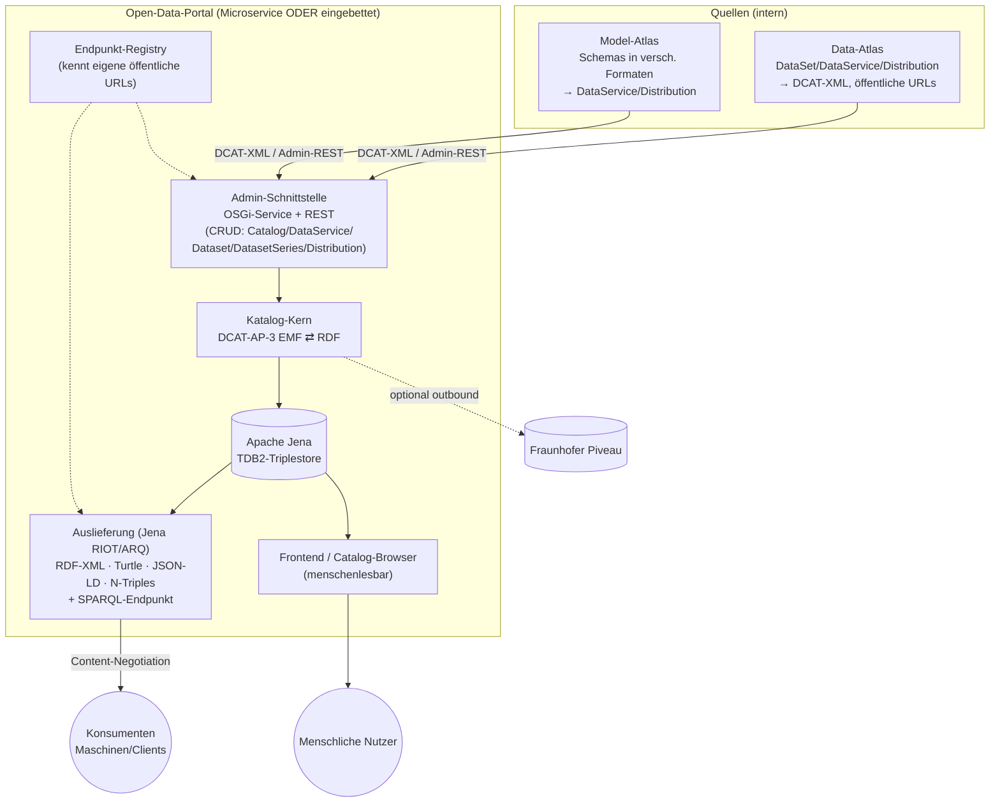

# Fennec Open-Data-Portal (DCAT-AP) — Planung

> Stand: 2026-06-27 · Status: Entwurf zum Review
> Verantwortlich: Mark (techn. Koordination/Architektur)
> Folgeschritt: Nach Review → GitHub-Projekt anlegen, Arbeitspakete als Issues anlegen (§13).

## 1. Ziel & Abgrenzung

Ein **DCAT-AP-konformes Open-Data-Portal**, das aus den Fennec-Bausteinen **Data-Atlas** und **Model-Atlas** gespeist wird und Kataloge sowohl **maschinenlesbar** (RDF in mehreren Serialisierungen + SPARQL) als auch **menschenlesbar** (UI-Catalog-Browser) bereitstellt.

| | Aufgabe |
|---|---|
| **Eingang** | DCAT-Beschreibungen kommen **bereits als DCAT-XML (RDF/XML)** aus dem Data-Atlas; Schema-Repräsentationen (in ihren verschiedenen Formaten) aus dem Model-Atlas. |
| **Kern** | DCAT-AP-3-EMF-Modell + **Apache-Jena-Persistenz** (Triplestore) als *eine Wahrheit* des Katalogbestands. |
| **Ausgang maschinell** | Kataloge/Datasets/Distributions in RDF/XML, Turtle, JSON-LD, N-Triples; SPARQL-Endpunkt. |
| **Ausgang menschlich** | UI, die Kataloge optisch aufbereitet darstellt. |
| **Pflege** | **Admin-REST-Schnittstelle** + dahinterliegende **OSGi-Services** zum Anlegen/Ändern/Löschen von Catalog, DataService, Dataset, DatasetSeries, Distribution. |
| **Optional** | Outbound-Connector zu **Fraunhofer Piveau** (analog MDO). |

**Bewusste Abgrenzung (Scope):**
- **Kein Harvesting** (kein Einsammeln fremder Kataloge). Es werden ausschließlich intern bereitgestellte Daten/Modelle publiziert.
- Distributions werden über ihre **öffentlichen URLs** registriert und müssen von dort erreichbar sein — das Portal speichert Metadaten/Verweise, **nicht** die Nutzdaten selbst.
- Das Portal ist **Microservice-fähig**: lauffähig als eigenständiger Dienst **oder** eingebettet (OSGi-Services) im Model-Atlas bzw. Data-Atlas.

**Leitidee:** Das Portal ist die *Publikationsschicht* über Data-/Model-Atlas. Die fachlichen Inhalte entstehen dort (DCAT wird aus dem Konfigurationsmodell des Data-Atlas „ausgespielt"); das Portal **sammelt, persistiert (Jena), liefert aus (Formate + UI)** und **meldet optional weiter (Piveau)**.

## 2. Ausgangslage (wiederverwendbares Material)

### 2.1 Vorhandenes im Data-Atlas-Repo
- **`workspace/org.eclipse.fennec.data.atlas.dcat.model`** — bereits portierter DCAT-AP-Stack: `dcatap`, `dcatap.de`, `skos`, `foaf`, `vcard`, `prov`, `odrl`, `locn`, `adms`, `terms`, `rdf(s)`, `owl`, `schema`. **Aktueller Stand ist DCAT-AP 2.x**: `Catalog`, `CatalogRecord`, `DataService`, `Dataset`, `DatasetContainer`, `Distribution`, `Relationship` — **`DatasetSeries` fehlt** (DCAT-AP-3-Neuerung). → Versions-Upgrade nötig (AP1).
- Planungskontext Data-Atlas: `docs/data-atlas-planung.md` (DCAT-Strang dort als AP5 referenziert; §7 „DCAT-Anbindung": Texte aus `EAnnotation`s, OData als DCAT-Backend, Catalog-Browser-UI).

### 2.2 Vorhandenes im MDO-Prototyp (`/opt/git/de-jena-MDO`)
Beweist die End-to-End-DCAT-Pipeline; portierbar statt neu zu bauen:

| MDO-Modul | Inhalt | Verwendung im Portal |
|---|---|---|
| `de.jena.piveau.model` | DCAT-AP-EMF-Modell (`dcatap.ecore`, RDF/XML-gemappt) | Quelle für AP1-Upgrade (Abgleich mit `dcat.model`) |
| `de.jena.piveau.api` | `RDFHelper`/`RDFBuilder` (baut DCAT-EMF aus Properties), `DatasetProvider`, `DistributionProvider`, `PiveauRegistry`, Connectors | RDF-Bau & Provider-Muster für AP2/AP5/AP6 |
| `de.jena.piveau.rest.jakarta` | `PiveauRestConnector` (Outbound zu Piveau-REST) | Basis für AP8 (Piveau-Connector) |
| `de.jena.mdo.piveau` | `MDOPiveauProvider` — erzeugt Datasets/Distributions aus Endpunkten, Texte aus `EAnnotation`s (`"Piveau"`) | Ableitungslogik für AP5 |
| `de.jena.mdo.dcatap.de.model` | DCAT-AP.de-Variante | Referenz für `dcatap.de` |

**Wichtig:** MDO hält DCAT als **EMF** und serialisiert nach **RDF/XML** (über EMF-XML-Resource). Genau dieses „DCAT-XML" ist das, was im Portal **eingeht**. **Apache Jena gibt es bisher nirgends** — es ist die **neu einzuführende** Schicht für Persistenz, Mehrformat-Ausgabe und SPARQL.

### 2.3 Die zentrale Brücke (das eigentlich Neue)
> EMF-DCAT (eingehend als RDF/XML)  →  **in Jena-`Model` laden**  →  **TDB2-Triplestore persistieren**  →  RIOT-Ausgabe (Turtle/JSON-LD/N-Triples) + ARQ/SPARQL  +  UI.

Alles davor (DCAT-Erzeugung aus Annotations/Endpunkten) existiert als MDO-Prototyp; alles danach (Jena-Persistenz/Ausgabe/SPARQL/UI) ist neu.

## 3. Architektur-Zielbild



**Lesart:** Inhalte werden über die Admin-Schnittstelle (REST + OSGi) angemeldet, im DCAT-AP-3-Modell normalisiert, als RDF in Jena persistiert und von dort in allen Formaten + per SPARQL + als UI ausgeliefert. Die **Endpunkt-Registry** stellt sicher, dass das Portal in der Microservice-Umgebung seine eigenen öffentlichen URLs kennt und Distributions korrekt mit ihren öffentlichen URLs referenziert/erreichbar bleiben.

## 4. Komponenten im Detail

### 4.1 DCAT-AP-3-Modell (AP1)
- Upgrade des `dcat.model` von 2.x → 3: u. a. **`DatasetSeries`** (+ `inSeries`/`seriesMember`-Beziehungen), aktualisierte verpflichtende/empfohlene Properties, ggf. angepasste Vokabular-Referenzen. Abgleich mit MDO-`dcatap.ecore`.
- Gemäß Arbeitsweise: **Ecore-Inhalte werden vor dem Generieren mit dem User abgestimmt** — dieses Dokument legt nur die fachliche Zielstruktur fest.

### 4.2 Jena-Persistenz & EMF⇄RDF-Brücke (AP2)
- **Triplestore:** Apache Jena **TDB2** (eingebettet, transaktional). Datenbank-Layout: ein Default-Graph + Named Graphs pro Catalog (erleichtert mandanten-/katalogweises Löschen).
- **EMF → RDF:** eingehendes DCAT-XML in Jena-`Model` laden (RIOT-Reader RDF/XML); alternativ direkter EMF→Jena-Mapper über die RDF-Mappings im Ecore. Entscheidung in §11.
- **RDF → EMF** (für UI/Editier-Roundtrip, falls nötig): Lade-Pfad zurück ins EMF-Modell.
- Wiederverwendung: `RDFHelper`/`RDFBuilder` aus `de.jena.piveau.api` für den DCAT-EMF-Aufbau.

### 4.3 Admin-Schnittstelle (AP3)
- **OSGi-Service-API** (`CatalogAdminService` o. ä.): CRUD für Catalog, DataService, Dataset, DatasetSeries, Distribution. Dient eingebetteten Aufrufern (Model-/Data-Atlas im selben Prozess) **und** dem REST-Layer.
- **REST-Layer** (Jakarta RS Whiteboard, wie MDO): dünner Adapter über die OSGi-API; nimmt DCAT-XML entgegen oder strukturierte Payloads; Validierung gegen DCAT-AP-3-Constraints.
- Idempotenz/Upsert über stabile IDs (Distribution-/Dataset-URI), damit der Data-Atlas wiederholt „ausspielen" kann.

### 4.4 Auslieferung (AP4)
- **Content-Negotiation** je Ressource (Catalog/Dataset/DatasetSeries/DataService/Distribution): RDF/XML, Turtle, JSON-LD, N-Triples (Jena RIOT).
- **SPARQL-Endpunkt** (ARQ; optional Fuseki-kompatibel exponiert).
- Stabile, **dereferenzierbare URIs** entlang der öffentlichen Basis-URL (→ Endpunkt-Registry AP7).

### 4.5 Endpunkt-/Microservice-Awareness (AP7)
- Konfigurierbare **öffentliche Basis-URL(s)** des Portals; Auflösung interner → öffentlicher URLs.
- Distributions aus dem Data-Atlas tragen ihre **öffentliche `accessURL`/`downloadURL`** — das Portal registriert/validiert Erreichbarkeit (optional Health-Check) und verfälscht sie nicht.
- Service-Discovery-Anbindung der Microservice-Umgebung (Konfig-Quelle für die eigene Adresse).

### 4.6 Frontend / Catalog-Browser (AP9)
- Menschenlesbare Darstellung: Katalog-Übersicht → Dataset/DatasetSeries-Detail → Distributions (mit Download-/Access-Links), DataService-Anzeige, Facetten/Suche (über SPARQL).
- Pro Ressource Format-Umschalter / „View source" (Turtle/JSON-LD …).
- Tech-Entscheidung UI-Stack offen (§11).

### 4.7 Piveau-Connector (AP8, optional)
- Outbound-Registrierung von Datasets/Distributions an eine externe Piveau-Instanz, portiert aus `de.jena.piveau.rest.jakarta` + Connectors. Per Konfiguration aktivierbar.

## 5. Schnittstelle zum Data-Atlas
- Der Data-Atlas erzeugt aus seinem **Konfigurationsmodell** DCAT (Texte/Keywords/Theme aus `EAnnotation`s, Muster `MDOPiveauProvider`) und **ruft die Admin-Schnittstelle** des Portals auf (REST extern / OSGi eingebettet).
- Jeder `DataService.getDistributions()` → eine **DCAT-Distribution** mit öffentlicher URL.
- Korrespondiert mit AP5 in `docs/data-atlas-planung.md` (dort: „DCAT-Provider"). **Schnittstellenvertrag** (Payload-Form, IDs, Upsert-Semantik) wird hier definiert und dort konsumiert.

## 6. Schnittstelle zum Model-Atlas
- Model-Atlas liefert **Schemas in verschiedenen Formaten** (z. B. Ecore/XSD/JSON-Schema/…). Diese werden als **DataService** (Schema-Endpunkt) bzw. **Distribution** (konkrete Format-Repräsentation) in den Katalog eingetragen.
- Anbindung wahlweise eingebettet (OSGi) oder via Admin-REST.

## 7. Microservice-Betriebsmodelle
1. **Standalone-Microservice:** eigenes Deployable, eigene Jena-TDB2, eigene öffentliche URL.
2. **Eingebettet:** als OSGi-Bundles innerhalb Model-Atlas oder Data-Atlas mitlaufend (gemeinsame Runtime, Admin nur über OSGi-Service).
→ Architektur muss beide tragen: **OSGi-Service-API als primärer Kontrakt**, REST als optionaler Adapter darüber.

## 8. Technologie-Stack (Vorschlag)
- **OSGi** (bnd/Gradle, analog Model-/Data-Atlas), Jakarta RS Whiteboard für REST.
- **EMF** für das DCAT-AP-3-Modell; **Apache Jena** (TDB2, RIOT, ARQ) für Persistenz/Serialisierung/SPARQL.
- **UI:** offen (§11) — leichtgewichtiges Web-Frontend.
- **Tests:** OSGi-Integrationstests (analog `*.tests`-Module in MDO).

## 9. Nicht-funktionale Anforderungen
- DCAT-AP-3-Konformität (validierbar), stabile dereferenzierbare URIs, Content-Negotiation.
- Mehrmandanten-/Mehrkatalog-fähig (Named Graphs).
- Idempotente Admin-Operationen (wiederholtes Ausspielen).
- Erreichbarkeits-/Konsistenzprüfung der öffentlichen Distribution-URLs.
- Beide Betriebsmodelle (standalone/eingebettet) ohne Codeänderung.

## 10. Risiken & Annahmen
- **EMF⇄RDF-Treue:** RDF/XML-Roundtrip zwischen EMF-DCAT und Jena muss verlustfrei sein (Blank Nodes, Sprach-Tags, Datentypen). Früh per Testkorpus absichern.
- **DCAT-AP-3-Delta:** Umfang des Modell-Upgrades erst nach Ecore-Abgleich genau bezifferbar.
- **URI-Strategie** ist Querschnitt (Persistenz, Ausgabe, Endpunkt-Registry, UI) — früh festlegen.
- Annahme: Data-Atlas liefert valides DCAT-XML; Validierung trotzdem portalseitig.

## 11. Offene Entscheidungen (für den Review)
1. **EMF→RDF-Pfad:** über RDF/XML-Serialisierung (einfach, MDO-nah) **oder** direkter EMF→Jena-Mapper (sauberer, mehr Aufwand)?
2. **UI-Stack:** Server-Templating (z. B. im OSGi-Whiteboard) vs. SPA (eigenes Frontend-Build) — Aufwand/Team-Präferenz.
3. **SPARQL-Exposition:** eingebettet ARQ-only oder vollwertiger Fuseki-Endpunkt?
4. **Repo-Struktur:** eigenes Repo `fennec-opendata.portal` vs. Modul im Data-Atlas-Workspace. Bundle-Namensschema (`org.eclipse.fennec.opendata.*`?).
5. **Piveau-Connector:** Pflicht-AP oder optionaler Backlog-Strang?
6. **DCAT-AP.de:** parallel zu DCAT-AP 3 pflegen oder zurückstellen?
7. **AuthN/AuthZ** der Admin-Schnittstelle (Keycloak wie MDO?) — in Scope?

## 12. Arbeitspakete

> Aufwände sind **grobe T-Shirt-Schätzungen** (S/M/L) — es gibt noch keine kalibrierte Quelle für diesen Strang (xDP betrifft Data-Atlas). Jedes AP ist in GitHub-Issue-große Tasks zerlegt.

### AP0 — Projekt-Setup & Build · **S**
Ziel: lauffähiges, bauendes Bundle-Skelett.
- [ ] Repo-/Modul-Struktur festlegen (§11.4), Bundle-Namensschema
- [ ] Gradle/bnd-Setup analog Model-/Data-Atlas, `cnf`/Repos
- [ ] CI-Pipeline (Build + Tests), Lizenz/Compliance-Header
- [ ] README + Projekt-Grundgerüst, OSGi-Runtime-Bndrun (standalone)

### AP1 — DCAT-AP-3-Modell-Upgrade · **M**
Ziel: `dcat.model` auf DCAT-AP 3 gehoben, codegeneriert.
- [ ] Delta-Analyse 2.x → 3 (`dcat.model` ↔ MDO-`dcatap.ecore` ↔ Spez)
- [ ] **`DatasetSeries`** + Beziehungen (`inSeries`/`seriesMember`) modellieren
- [ ] Pflicht-/Empfohlen-Properties, Vokabular-/Datentyp-Updates
- [ ] genmodel aktualisieren, Code generieren *(Ecore-Inhalte vorab mit User abstimmen)*
- [ ] Optional: `dcatap.de`-Abgleich (§11.6)
- [ ] Modell-Validierung gegen offizielle SHACL-Shapes (Testkorpus)

### AP2 — Jena-Persistenz & EMF⇄RDF-Brücke · **L**
Ziel: DCAT in Jena persistierbar, verlustfreier Roundtrip.
- [ ] Jena-TDB2 als OSGi-Service einbinden (Lifecycle, Transaktionen)
- [ ] Named-Graph-Layout (pro Catalog) festlegen
- [ ] EMF-DCAT → Jena-`Model` (Pfad gem. §11.1), Wiederverwendung `RDFBuilder`/`RDFHelper`
- [ ] Jena → EMF (Lese-/Roundtrip-Pfad)
- [ ] Roundtrip-/Treue-Tests (Blank Nodes, Sprach-Tags, Datentypen)
- [ ] URI-/ID-Strategie implementieren (Querschnitt)

### AP3 — Admin-Schnittstelle (OSGi + REST) · **M**
Ziel: CRUD für alle DCAT-Entitäten, eingebettet & via REST.
**Detail-Spezifikation: [`opendata-portal-admin-api.md`](opendata-portal-admin-api.md)** (Entitäten, funktionale Requirements FR-1..FR-21, REST-Endpunkte, OSGi-Service-Kontrakt).
- [ ] OSGi-Service-API `CatalogAdminService` / `CatalogRelationService` / `CatalogIngestService` / `DcatValidationService` (Catalog/DataService/Dataset/DatasetSeries/Distribution)
- [ ] Implementierung gegen Jena-Persistenz (Upsert/idempotent, transaktional)
- [ ] Beziehungs-/Mitgliedschafts-Endpunkte (FR-9/10/11)
- [ ] Massen-Ingest ganzer DCAT-Dokumente (FR-13/14/15) — Anbindung Data-/Model-Atlas
- [ ] REST-Adapter (Jakarta RS Whiteboard) inkl. DCAT-XML-Eingang, Content-Negotiation
- [ ] Eingangs-Validierung (DCAT-AP-3-SHACL, FR-4/5) + ETag/If-Match (FR-7)
- [ ] Fehler-/Statuscodes (FR-19), OpenAPI-Beschreibung der Admin-API
- [ ] Optional AuthN/AuthZ (FR-21, §11.7)

### AP4 — Katalog-Auslieferung (Formate + SPARQL) · **M**
Ziel: maschinenlesbare Auslieferung in allen Formaten.
- [ ] Read-REST je Ressource mit **Content-Negotiation**
- [ ] RIOT-Serializer: RDF/XML, Turtle, JSON-LD, N-Triples
- [ ] SPARQL-Endpunkt (ARQ; Fuseki-Option §11.3)
- [ ] Dereferenzierbare URIs entlang öffentlicher Basis-URL
- [ ] Caching/Pagination für große Kataloge

### AP5 — Anbindung Data-Atlas (Distributions/Datasets) · **M**
Ziel: Data-Atlas spielt DCAT ins Portal aus.
- [ ] **Schnittstellenvertrag** definieren (Payload, IDs, Upsert) — Gegenstück zu data-atlas AP5
- [ ] DCAT-Ableitung aus Konfig-Modell/Annotations (Muster `MDOPiveauProvider`)
- [ ] `getDistributions()` → Distribution mit öffentlicher URL
- [ ] End-to-End-Test: Data-Atlas → Admin → Jena → Ausgabe

### AP6 — Anbindung Model-Atlas (Schemas) · **S–M**
Ziel: Schemas als DataService/Distribution im Katalog.
- [ ] Mapping Schema-Formate → DataService/Distribution
- [ ] Anbindung (OSGi eingebettet / REST)
- [ ] Test: Schema erscheint im Katalog + dereferenzierbar

### AP7 — Endpunkt-/Microservice-Awareness · **S–M**
Ziel: Portal kennt eigene öffentliche URLs; Distributions erreichbar.
- [ ] Konfig der öffentlichen Basis-URL(s), interne→öffentliche Auflösung
- [ ] Service-Discovery-Anbindung (eigene Adresse)
- [ ] Erreichbarkeits-/Health-Check der Distribution-URLs (optional)
- [ ] Verhalten standalone vs. eingebettet absichern

### AP8 — Piveau-Connector (optional) · **M**
Ziel: Outbound-Registrierung an Fraunhofer Piveau.
- [ ] `PiveauRestConnector` + Connectors aus MDO portieren
- [ ] Konfigurierbares Aktivieren, Mapping DCAT-AP 3 → Piveau-API
- [ ] Integrationstest gegen Piveau (analog `de.jena.piveau.tests`)

### AP9 — Frontend / Catalog-Browser · **L**
Ziel: optisch aufbereitete Katalogdarstellung.
- [ ] UI-Stack-Entscheidung (§11.2) + Grundgerüst
- [ ] Katalog-Übersicht, Dataset/DatasetSeries-Detail, Distributions, DataService
- [ ] Suche/Facetten (über SPARQL)
- [ ] Format-/„View-source"-Umschalter pro Ressource
- [ ] Responsives Layout, Barrierefreiheit-Grundlagen

### AP10 — Betrieb & Deployment · **M**
Ziel: beide Betriebsmodelle produktiv.
- [ ] Standalone-Deployable (Container/Bndrun) inkl. TDB2-Volume
- [ ] Eingebettetes Bundle-Set für Model-/Data-Atlas
- [ ] Konfig-Doku (öffentliche URL, Piveau, Auth)
- [ ] Logging/Monitoring/Health-Endpoints
- [ ] Backup/Restore des Triplestore

### AP11 — Dokumentation · **S–M**
Ziel: Architektur-, Betriebs- und API-Doku.
- [ ] Architektur-/Komponentendoku (dieses Dokument fortschreiben)
- [ ] Admin-API-Referenz (OpenAPI) + Beispiel-Payloads
- [ ] Betriebshandbuch (Setup standalone + eingebettet)
- [ ] Integrationsleitfaden Data-Atlas/Model-Atlas
- [ ] Endnutzer-Doku Catalog-Browser/SPARQL

### Querschnitt — Qualitätssicherung
- [ ] Testkorpus echter DCAT-Beispiele (Roundtrip/Konformität)
- [ ] DCAT-AP-3-SHACL-Validierung in CI
- [ ] OSGi-Integrationstests pro AP

## 13. Empfohlene Reihenfolge

```
AP0 ─► AP1 ─► AP2 ─┬─► AP3 ─► AP4 ─► AP5 ─► AP6
                   └─► AP7 (parallel ab AP2)
AP9 (UI) parallel ab AP4 ·  AP8 (Piveau) optional nach AP4 ·  AP10/AP11 begleitend
```

**Kritischer Pfad:** AP1 → AP2 → AP3 → AP4 (Modell, Persistenz, Pflege, Auslieferung). Erst danach liefern AP5/AP6 echte Inhalte und AP9 macht sie sichtbar.

## 14. Nächste Schritte
1. **Review** dieses Dokuments; offene Entscheidungen §11 klären.
2. Danach: **GitHub-Projekt** anlegen, AP0–AP11 als Meilensteine, die Checklisten-Items als **Issues**.
3. AP1 starten — Ecore-Delta für DCAT-AP 3 **vorab mit dem User abstimmen**, dann generieren.
